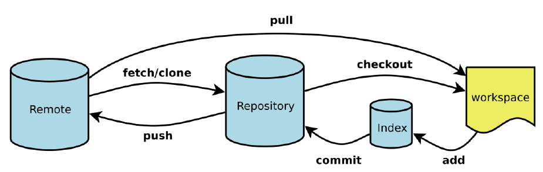
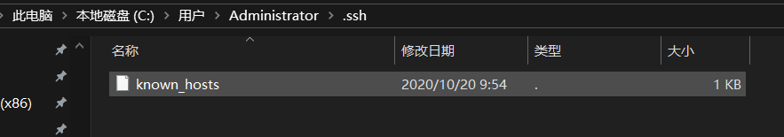
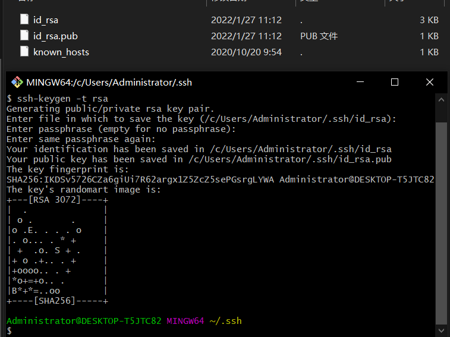
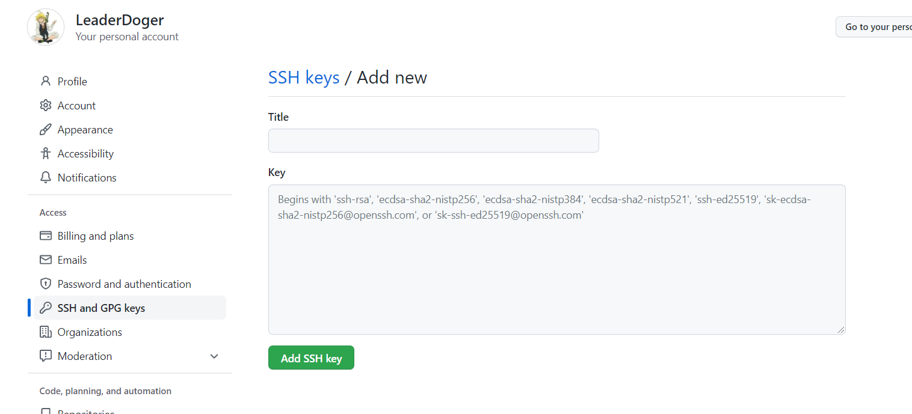

# 常用的Linux命令

平时一定要多使用这些基础的命令！

1）、cd : 改变目录。

2）、cd . . 回退到上一个目录，直接cd进入默认目录

3）、pwd : 显示当前所在的目录路径。

4）、ls(ll): 都是列出当前目录中的所有文件，只不过ll(两个ll)列出的内容更为详细。

5）、touch : 新建一个文件 如 touch index.js 就会在当前目录下新建一个index.js文件。

6）、rm: 删除一个文件, rm index.js 就会把index.js文件删除。

7）、mkdir: 新建一个目录,就是新建一个文件夹。

8）、rm -r : 删除一个文件夹, rm -r src 删除src目录

```
rm -rf /  切勿在Linux中尝试！删除电脑中全部文件！
```

9）、mv 移动文件, mv index.html src index.html 是我们要移动的文件, src 是目标文件夹,当然, 这样写,必须保证文件和目标文件夹在同一目录下。

10）、reset 重新初始化终端/清屏。

11）、clear 清屏。

12）、history 查看命令历史。

13）、help 帮助。

14）、exit 退出。

15）、#表示注释

# Git配置

#### 查看配置信息

```
git config -l
git config --system --list //查看系统配置信息
git config --global --list //查看当前用户(global)配置
```

**Git相关的配置文件：**

1）、Git\etc\gitconfig ：Git 安装目录下的 gitconfig --system 系统级

2）、C:\Users\Administrator\ .gitconfig 只适用于当前登录用户的配置 --global 全局

#### 设置用户名和密码

```
git config --global user.name "kuangshen"  #名称
git config --global user.email 24736743@qq.com   #邮箱
```

#### 原理图



#### 克隆远程仓库

```
git clone [url] https://github.com/LeaderDoger/LeaderDoger.github.io.git
```

#### 添加到暂存里

```
git add [filename]
```

#### 提交到本地仓库里

```
git commit -m "提交备注"
```

#### 同步到线上仓库

```
git push origin master
```

#### 设置忽略文件

有些时候我们不想把某些文件纳入版本控制中，比如数据库文件，临时文件，设计文件等

在主目录下建立".gitignore"文件，此文件有如下规则：

1. 忽略文件中的空行或以井号（#）开始的行将会被忽略。
2. 可以使用Linux通配符。例如：星号（*）代表任意多个字符，问号（？）代表一个字符，方括号（[abc]）代表可选字符范围，大括号（{string1,string2,...}）代表可选的字符串等。
3. 如果名称的最前面有一个感叹号（!），表示例外规则，将不被忽略。
4. 如果名称的最前面是一个路径分隔符（/），表示要忽略的文件在此目录下，而子目录中的文件不忽略。
5. 如果名称的最后面是一个路径分隔符（/），表示要忽略的是此目录下该名称的子目录，而非文件（默认文件或目录都忽略）。

```
#为注释
*.txt        #忽略所有 .txt结尾的文件,这样的话上传就不会被选中！
!lib.txt     #但lib.txt除外
/temp        #仅忽略项目根目录下的TODO文件,不包括其它目录
tempbuild/   #忽略build/目录下的所有文件doc
/*.txt       #会忽略 doc/notes.txt 但不包括 doc/server/arch.txt
```

#### 使用SSH公钥实现免密码登录



进入该用户的.ssh文件，使用ssh-keygen

```
ssh-keygen -t rsa /推荐
```

生成两个文件后结束



将公钥添加进账户里



#### 使用ssh可能会发生的问题

> 1、使用ssh方式克隆 git clone git@gitee.com:Name/project.git
> 就是说，在项目克隆/下载处，选择ssh方式的下载地址
> 2、如果你已经用https方式克隆了仓库，不必删除仓库重新克隆，只需将当前项目中的 .git/config文件中的
> url = https://gitee.com/Name/project.git
> 修改为
> url = git@gitee.com:Name/project.git
> 再次提交就不需要密码了！

