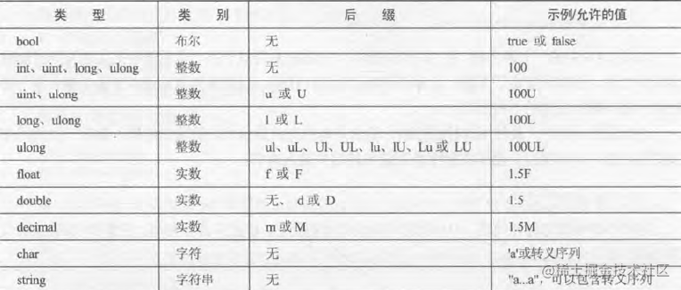
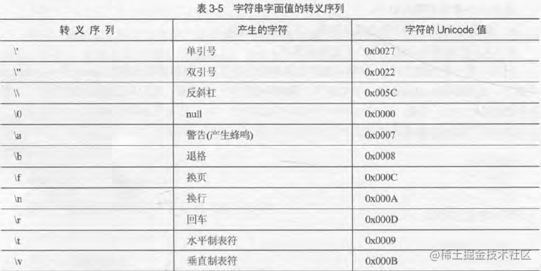
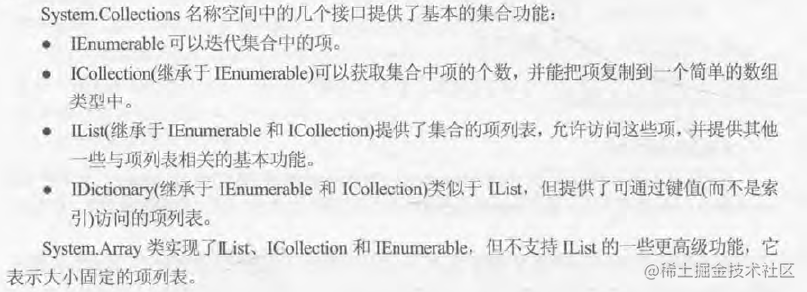
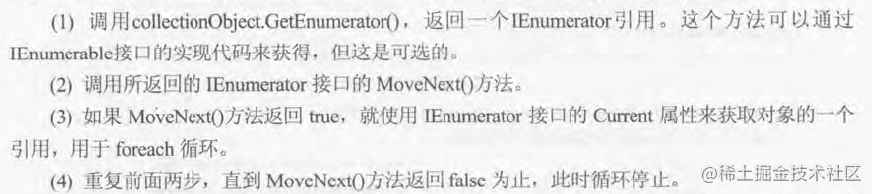
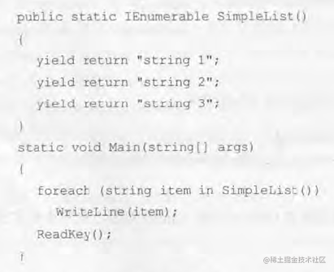
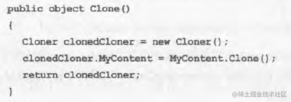
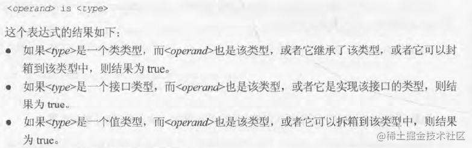
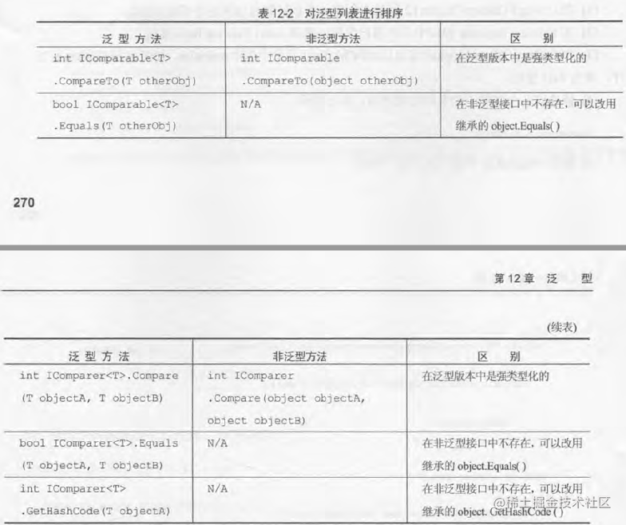
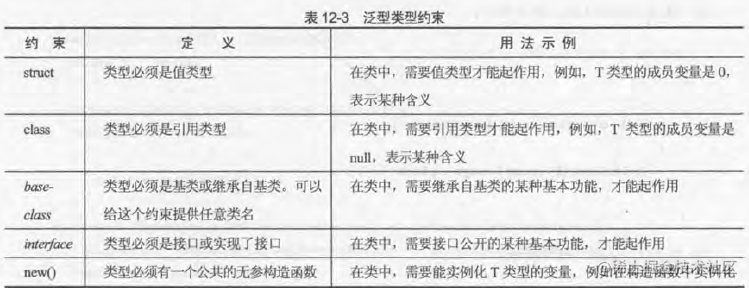

**注意**：C#区分大小写

### 常数



### 转义字符



### 命名空间
using本身不能访问另一个名称空间。除非名称空间中的代码以某种方式链接到项目上，或者代码是在该项目的源文件中定义的。
using static 允许把静态成员直接包含到C#程序的作用域中。

### 类型转换
隐式转换由小转大，一般没有问题

显示装换使用Convert.TO...()

checked（）对溢出进行检查

多维数组的初始化方式：
1. int[,] array=new int[n,m];
2. int[,] array={{...},{...}};
3. int[][] array={new int{...},new int{...},new int{...}};

### 字符串处理
大小写转换：string.TOLower(),string.TOUpper()

去掉字符串的空格、前后空格：String.Trim(),String TrimStart,String.TrimEnd()

### 结构函数
结构函数可以直接读取结构中的变量和类相似

### 委托
声明一个特殊返回值和入参的函数指针类型，像接口一样具体实现由后续赋值的函数实现。

```C#
delegate double ProcessDelegate(double param1,double param2);
ProcessDelegate process;
process= new ProcessDelegate(Multiply);
process=Multiply;
```

### 事件
以委托为类型的变量，事件在生成的时候会调用委托。事件还可以进行多播，按照加入顺序执行委托。

```c#
public delegate void BoilerLogHandler(string status);
// 基于上面的委托定义事件
public event BoilerLogHandler BoilerEventLog;
```

### 调试小技巧

项目属性页面-》Degbug页面，在Command line arguments写入软件输入的参数

调试信息输出用Debug.WriteLine()和Trace.WriteLine()，在发布版本中Debug会消失，但Trace不会
```c#
Debug.WriteLine("Added 1 to i","MyFunc");
结果为 MyFunc:Added 1 to i
```

## 面向对象编程
### 可访问性
1. public：访问不受限制；  
2. internal：访问仅限于所属程序集；  
3. protected：访问仅限于当前类和其子类；  
4. internal protected：访问仅限于当前程序集或其子类（子类可以不属于当前程序集）；  
5. private：访问仅限于包含该成员的类型。

### 类
类里包含属性和字段、方法

如果为了让其他项目的代码可以访问，应该被public修饰；抽象类被abstract修饰；密封类被sealed修饰。指定继承用：，但只能有一个基类，也可继承多个接口并用逗号隔开

派生类的可访问性不能高于基类，即公共类不能继承与一个内部积累

### 生命周期
构造阶段、正在使用、析构阶段

### 静态成员和实例类成员
静态构造函数的调用只有在**创建包含静态构造函数的类实例**时和**访问包含静态构造函数的类的静态成员时**

静态类只包含静态成员且不能被实例化（不包含实例构造函数，但可以有一个**静态构造函数**）

### 接口
接口无法被实例化且不能包含实现其成员的任何代码，只可以定义成员本身，它只是把公共实例发放和属性组合起来，以封装待定功能的一个集合。

升级接口应该创建一个新的接口，使其拓展旧接口，可能还包含一个版本号

不实例化接口，但可以建立接口类型的变量，然后使用这个变量访问该接口提供的方法和属性

```C#
IConsume consumeInterface;
consumeInterface = myCow;
consumeInterface.EatFood();
consumeInterface = myCow;
consumeInterface.EatFood();
```

IDisposable接口必须实现Dispose()，当不需要某个对象（在对象超出作用域之前）时调用这个方法，释放重要资源，否则只有等到gc用解析方法时才会释放资源。using关键字在代码块使用重要资源对象，在代码块末尾会自动调用Dispose()


```C#
using (VaribaleName)
{
...
}
using (ClassName VaribaleName = new ClassName())
{
...
}
```
所有接口成员都是隐式公共的，不能包含代码体和定义字段成员，要隐藏从基接口的成员用new


### 继承
派生类不能访问基类的私有成员，但public和protected可以，外部只可以访问public。

可以将子类强转至父类乃至基类。

### Object
Equals(object)、Equals(object，object)判断对象是否相等

ToString()可以被重写

GetType()返回对象类型

GetHashCode()返回压缩形式表示对象状态的值


### 类成员
#### 字段 
访问器

```C#
private int myInt;
public int MyIntProp{
    get { return myInt; }
    set {}
}
```
get块必须有一个属性类型的返回值

类外部代码不能直接访问myInt字段

### 隐藏基类方法
在基类成员前加new即可

```C#
public class MyDerivedClass:MyBaseClass
{
    new public void DoSomething(){
        //...
    }
}
```

调用此方法使用base基类实例对象调用，但在静态成员中使用它会产生报错。同理，this是当前实例对象。

### 嵌套的类型定义
如果类型嵌套定义，就不仅可以被public和internal修饰，也可以如上文被new隐藏。

其次，要在外部实例化里面定义的类型需要添加限定名，A.B C=new A.B();
如果嵌套的类声明为私有则不能这么做。

### 部分类
使用部分类定义，把类的定义放在多个文件中。

### 部分方法
在一个部分类中定义，在另一个部分类中实现，都要使用partial关键字。部分方法可以是静态的，但总是私有的且没有返回值，入参不能是out参数，但可以是ref参数。

在编译阶段，如果该方法没有实现，则编译器会完全删除该方法和该方法的所有调用。

### System.Collections
Collections提供的基本集合功能：



### ArrayList
不需要设定大小，当集合中的项数超过当前容量，容量就会自动倍增。


### 索引符
IList.List返回一个System.Object对象，所以需要进行强制转换。
```C#
public Animal this[int animalIndex]
{
    get {return (Animal)List[animalIndex];}
    Set {List[animalIndex]=value;}
}
```

DictionaryBase使用foreach需要使用强转，CollectionBase则不需要

### 迭代器

主要步骤





yield break;可中断将信息返回给迭代器的过程


### 深度复制
实现ICloneable接口中的Clone()并返回object类型。有时以递归形式实现



### 类型比较
可以使用Object中的typeof()和GetType(),进行类型上的比较。
`if(myObj.GetType() == typeof(MyComplexClass)){}`

### is运算符
is运算符用来检查对象是不是给定类型。个人感觉应该是判断是不是同簇。


### 拆箱封箱
封箱就是把值类型转换为Object类型，或者是由值类型实现的接口类型，反之就是拆箱。
```c#
struct MyStruct
{
   public int Val;
}
Mystruct valType1 = new MyStruct();
valType1.Val=5;
object refType = valType1;
```
这种方式封箱创建的对象会包含值类型变量的一个副本的引用，而不包含源值类型变量的引用。（结构封箱无法修改，类封箱却能修改）总的来说访问值类型内容前，必须进行拆箱。

```C#
 interface IMyInterface { }
 struct MyStruct : IMyInterface
 {
     public int Val;
 }
 
 MyStruct valType1 = new MyStruct();
 IMyInterface refType = valType1;
 MyStruct valType2 = (MyStruct)refType;
```

### 值比较
方法一：使用运算符重载
```C#
public static AddClass1 operator +(AddClass1 op1,AddClass1 op2)
{
    AddClass1 returnVal = new AddClass1();
    returnVal.val = op1.val + op2.val;
    return returnVal;
}
```
酌情使用，因为如果运算符重载出现在两种类型里面，这两种类型同时调用时会失败，因为弄不清要使用哪个运算符。所以不要把签名相同的运算符添加到多个类中。如果操作数的顺序错误，操作也会失败

一些运算符必须成对重载，通常需要重写Object.Equals()和Object.GetHashCode()

方法二：使用ICmoparable和IComparer接口。
- IComparable在要比较的对象的类中实现，可以比较该对象和另一个对象
- IComparer在一个单独的类中实现，可以比较任意两个对象

IComparable提供方法CompareTo()接收一个对象，返回int<br>
IComparer提供方法CompareTo()接收两个对象，返回int<br>

### 类之间的转换
用implicit(隐式)和explicit（显式）来指定这类转换

```C#
public static implicit operator ConvClass2(ConvClass1 op1)
{
    ConvClass2 returnVal = new ConvClass2();
    returnVal.val = op1.val;
    return returnVal;
}
public static explicit operator ConvClass1(ConvClass2 op1)
{
    ConvClass2 returnVal = new ConvClass2();
    returnVal.val = op1.val;
    return returnVal;
}
ConvClass1 op1 = new ConvClass1();
ConvClass2 op2 = op1;
ConvClass2 op2 = (ConvClass)op1;
```

### as运算符
把一种类型转换为指定的引用类型，如果不能转换，则表达式的结果是null


### 泛型
#### 可空类型
可以使一些没有空类型的类型赋上null,也可以用HasValue属性判断
```C#
System.Nullable<int> nullableInt;
nullableInt=null;
if(nulllableInt==null){}
if(nullableInt.HasValue){}
int?是System.Nullable<int>的缩写
```
#### ??运算符
给出其中不是空的操作数

```C#
op1 ?? op2
op1 == null ? op2 : op1 
```
#### ?运算符
用来简化判空的过程返回null，配合??返回默认值。

`int? count = customer.orders?.Count() ?? 0 ;`

#### List\<T>
List\<T>的排序需要在排序的类型上提供IComparable\<T>或者IComparer接口


#### 对泛型列表进行排列和搜索

判断T类型是否满足某个条件可以使用泛函委托类型：
Comparison\<T>用于排序方法：
`int method(T objectA,T objectB)`

```C#
    Comparison<Vector> sorter = new Comparison<Vector>(VectorDelegates.Compare);
    route.Sort(sorter);
    route.Sort(VectorDelegates.Compare);//编译器会帮我们创建Comparioson<Vector>对象
```
Predicate\<T>用于搜索方法：
`bool method(T targetObject)`
```C#
    Predicate<Vector> searcher = new Predicate<Vector>(VectorDelegates.TopRightQuadrant);
    Vectors topRightQuadrantRoute = new Vectors(Route.FindAll(searcher);
```

#### Dictionary<K,V>
Dictionary允许把IComparer\<K>接口传递给其构造函数，如果要把自己的类用作键且IComparable和IComparable接口或者使用非默认的过程比较对象，就必须把IComparer\<K>接口传入构造函数。

### 定义泛型类
`class MyGenericClass<T1,T2,T3>{ }`
#### 泛型类中继承
`class SuperFarm<T> : Farm<T> where T : SuperCow{ }`<br>
错误示范：<br>
SuperFamr的T不能转换为Farm使用的T<br>
`class SuperFarm<T> : Farm<T> where T : struct{ }`<br>
约束为超集
`class SuperFarm<T> : Farm<T> where T : class{ }`<br>


#### default关键字
当不知道对象是引用类型还是值类型，使用default关键字，当对象是应用类型时赋值null,值类型时赋值默认值

#### 约束类型
可以使用where关键字和具体约束对泛型进行限制<br>
`class MyGenericClass<T> where T1 : constraint1,constraint2  where T2:constraint { }`

裸类型约束：T2必须与T1的类型相同或者继承T1
`class MyGenericClass<T1,T2> where T2 : T1`<br>
注意：约束不能循环，例如
`class MyGenericClass<T1,T2> where T2 : T1 where T1 : T2 {}`

### 变体
正常子类转父类有隐式转换，但是接口的泛型不承认。
以下例子无法运行：
```C#
IMethaneProducer<Cow> cowMethaneProducer = myCow;
IMethaneProducer<Animal> animalMethaneProducer = cowMethaneProducer;
```
#### 协变
协变就是子转父，在接口定义时使用out关键字，同时协变类型参数只能用作方法的返回值或属性get访问器<br>
`public interface IMethaneProducer<out T>{ }`

#### 抗变
抗变就是父转子,在接口定义时使用in关键字，抗变类型参数只能用作方法参数，不能用作返回类型
`public interface IComparer<in T>`

### ::运算符和全局名称空间限定符
::运算符会博士编译器使用using语句定义的别名，还可以与global一起使用，因为它是顶级根名称空间的别名。
`global::Systen.Collections.Generic.List<int>`

### 定制异常
基本异常类ApplicationException和SystemEx-ception

```C#
class CardOutOfRangeException : Exception
{ 
    public CardOutOfRangeException(Cards sourceDeckContents)
    : base("There are only 52 cards in the deck.")
    {
       deckContents = sourceDeckContents;
    }
}
public Card GetCard(int cardNum)
{
    throw new CardOutOfRangeException(cards.Clone() as Cards);
}
```

### 事件
委托可以订阅事件，当事件发生时，就会执行委托。

#### 定义事件
```C#
event <委托名> 事件名
eventName +=new delegateName(functionName);
eventName +=functionName;
evenName(args);
```

#### 多用途的事件处理程序
我们常常要为不同对象引发几个相同时间使用同一个事件处理程序，所以需要将对象类型抽象为object。一般来说，定义事件时，最好使用这些委托类型。如果不需要实参数据也可以，不过要用EvenArgs.Empty作为实参值。
```C#
public event EventHandler<MessageArrivedEventArgs>MessageArrived;
MessageArrived(this, new MessageArrivedEventArgs("Hello Mami!"));
public void DisplayMessage(object source,MessageArrivedEventArgs e)
{
    Console.WriteLine($"Message arrived from:{((Connection)source).Name}");
    Console.WriteLine($"Message Text:{e.Message}");
}
```

#### 返回值和事件处理程序
只允许访问最后一个订阅该时间的处理程序返回的值。最好使用void类型的事件处理程序，且避免使用out类型的参数（如果使用，参数返回的值的源头就是不清楚的）。

#### 匿名方法
除了定义事件处理方法外，还可以选择使用匿名方法。
```C#
delegate(parameters)
{
    ...
}
```

### 特性
库自带的特性位于System.Diagnostics名称空间中。引用该特性可以使用完整名称，可以去掉后缀Attribute

可以利用“反射”技术读取特性的值，通过System.Reflection名称空间中的各种类型来获取不同的类型信息。最简单且唯一的方法是通过Type.GetCustomAttributes()实现，第一个参数选择返回感兴趣的特性(可选)，第二个选择了解类本身还是派生类（必须）。


#### 创建特性
AttributeUsageAttribute可以通过|运算组合出我们需要的
值，同时它还有一个属性AllowMultiple指定是否可以多次应用特性。
```C#
[AttributeUsage(AttributeTargets.Class | AttributeTargets.Method,AllowMultiple = false)]
class DoesInterestingThingsAttribute : Attribute
{
    public DoesInterestingThingsAttribute(int howManTimes)
    {
        HowManyTimes = howManyTims;
    }
    public string WhatDoesItdo{get; set;}
    public int HowManyTimes {get;private set; }
}
[DoesInterestingThings(1000,WhatDoesItDo = "voodoo")]
public class DecoratedClass{}
```

### 初始化器
#### 类初始化器
初始化器没有替代默认无参构造函数
```C#
Origin = new Restaurant{
    Name = "King's Balti",
    Location = "York Road",
    Rating = 5
}
```
#### 集合初始化器
```C#
List<Curry>moreCurries = new List<Curry>
{
    new Curry
    {
        MainIngreDient = "Chicken",
        Style = "Pathia",
        Spiciness = 6
    },
    new Curry
    {
        ...
    },
}
```

### 类型推理
var关键字可以推理出变量的类型，由编译器填入类型

### 匿名类型
匿名类型属性的值不可被修改，所以要修改属性的值就不能使用匿名类型
```C#
var curry = new 
{
    MainIngredient = "Lamb",
    Style = "Dhansak",
    Spiciness = 5
};
```

### 动态查找
调用其他语言的函数可以直接按照对象的函数名直接调用
```C#
ScriptObject jsObj = SomeMethodThatGetsTheObject();
int sum = Convert.ToInt32(jsobj.Invoke("Add",2,3));

int sum = jsObj.Add(2,3);
```

### 动态类型
dynamic关键字，在声明时不需要初始化它的值，动态类型仅在编译期间存在，运行期间被Object类型代替。一旦有动态变量，就可以继续访问其成员。函数返回值不确定时，使用动态类型可以不用自己强转类型，和var差不多<br>
如果请求成员不存在则报异常，但代码依旧编译通过。

### 高级方法参数
#### 可选参数
默认值必须字面值、常量值或者默认值类型值，可选参数必须位于方法的参数列表末尾，没有默认值的参数不能放在有默认值的参数后面。<br>
`<parameterType><parameterName> = <defaultValue>`

#### Optiuonal特性
使用该关键字则该参数不允许提供默认值<br>
`[Optional]<parameterType><parameterName>`

### Lambda表达式
内联的匿名方法：
```C#
myTimer.Elapsed += delegate(object source,ElapsedEventArgs e)
{
    Console.WriteLine("${(source as Timer).Interval}");
}

static ovid PerformOperations(TwoIntegerOperationDelegate del)
{
    ...
    del(parameAVal,parameBVal);
}
PerformOperations((paramA,paramB)=>paramA+paramB);
```

- Action,表示的Lambda表达式不带参数，返回类型void
- Action<>,表示的Lambda表达式最多8个参数，返回类型void
- Func<>，表示的Lambda、表达式最多有8个参数，返回类型不是void


## 桌面编程
### 路由事件
当路由路由发生时，组件本身先得到时间，再发给父组件。如果不希望被继续往上传，只需要将RouteEvenArgs的属性Handled设置为true。
### 路由命令
如果一段代码只在应用程序中的一个位置发生的用户操作，当代码相应多个位置的操作时候就应该使用命令。

### 文件


