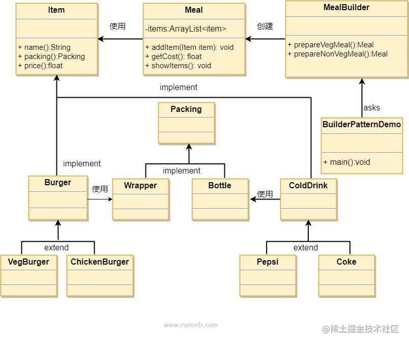

### 工厂模式
类根据输入返回生成的对象


### 抽象工厂模式
将工厂抽象成接口，保留实现方法，实现由后续入参链接

### 单例模式
将构造函数私有化且保证只有一个对象生成。有懒汉式和饿汉式，注意多线程下的对象生成保持一致性

```Java
public class SingleObject {
 
   //创建 SingleObject 的一个对象
   private static SingleObject instance = new SingleObject();
 
   //让构造函数为 private，这样该类就不会被实例化
   private SingleObject(){}
 
   //获取唯一可用的对象
   public static SingleObject getInstance(){
      return instance;
   }
 
   public void showMessage(){
      System.out.println("Hello World!");
   }
}
```
### 建造者模式
当生成对象的一些基本部件不会变，而其组合经常变化、需要生成的对象内部属性本身相互依赖的时候。与工厂模式的区别是：建造者模式更加关注与零件装配的顺序。


### 原型模式
当对象复杂到生成对应对象代价较大时，可以添加克隆接口，并在每次生成时候更新数据库，
等到下次选择相同对象时，直接取出并进行克隆

### 桥接模式
将对象方法分离出对象并抽象化，等后续实现方法入参链接


### 过滤模式
抽象出过滤方法，等待外部入参实现方法

### 组合模式
类中包含相同类的集合或者数组，当相同类要组合时加入其中即可


### 装饰器模式
**动态**地给一个对象添加一些额外的职责。就增加功能来说，装饰器模式相比生成子类更为灵活。
使用场景：1、扩展一个类的功能。 2、动态增加功能，动态撤销。
装饰器类实现了装饰方法，但抽象了装饰对象，通过入参获取装饰对象 


### 外观模式
何时使用：1、客户端不需要知道系统内部的复杂联系，整个系统只需提供一个"接待员"即可。 2、定义系统的入口。

**优点：**  1、减少系统相互依赖。 2、提高灵活性。 3、提高了安全性。

**缺点：** 不符合开闭原则，如果要改东西很麻烦，继承重写都不合适。

简单地将功能自动实现后对客户暴露接口

### 享元模式
**意图：** 运用共享技术有效地支持大量细粒度的对象。

**主要解决：** 在有大量对象时，有可能会造成内存溢出，我们把其中共同的部分抽象出来，如果有相同的业务请求，直接返回在内存中已有的对象，避免重新创建。

**如何解决：** 用唯一标识码判断，如果在内存中有，则返回这个唯一标识码所标识的对象。

**注意事项：**  1、注意划分外部状态和内部状态，否则可能会引起线程安全问题。 2、这些类必须有一个工厂对象加以控制。

有点像池化技术，重复利用已经生成的对象进行功能的实现。

```Java
import java.util.HashMap;
 
public class ShapeFactory {
   private static final HashMap<String, Shape> circleMap = new HashMap<>();
 
   public static Shape getCircle(String color) {
      Circle circle = (Circle)circleMap.get(color);
 
      if(circle == null) {
         circle = new Circle(color);
         circleMap.put(color, circle);
         System.out.println("Creating circle of color : " + color);
      }
      return circle;
   }
}
```

### 代理模式
**主要解决：** 在直接访问对象时带来的问题，直接访问会给使用者或者系统结构带来很多麻烦，我们可以在访问此对象时加上一个对此对象的访问层。

**注意事项：**  1、和适配器模式的区别：适配器模式主要改变所考虑对象的接口，而代理模式不能改变所代理类的接口。 2、和装饰器模式的区别：装饰器模式为了增强功能，而代理模式是为了加以控制。

ProxyPatternDemo通过ProxyImage访问RealImage


### 责任链模式

**意图：** 避免请求发送者与接收者耦合在一起，让多个对象都有可能接收请求，将这些对象连接成一条链，并且沿着这条链传递请求，直到有对象处理它为止。客户只需要将请求发送到职责链上即可，无须关心请求的处理细节和请求的传递，所以职责链将请求的发送者和请求的处理者解耦了。

将实现抽象接口的类串成链表，每个节点通过传入的信息判断是否满足处理的条件，满足则处理，接着传给下一个节点


### 命令模式

将命令实体化成类，将对象传入命令类执行，再将命令类装入执行类里。

**意图：** 将一个请求封装成一个对象，从而使您可以用不同的请求对客户进行参数化。

**主要解决：** 在软件系统中，行为请求者与行为实现者通常是一种紧耦合的关系，但某些场合，比如需要对行为进行记录、撤销或重做、事务等处理时，这种无法抵御变化的紧耦合的设计就不太合适。

通过实现Order的子类执行具体的任务Stock的各个部分，这样就方便进行撤回和重做。


### 解释器模式
**何时使用：** 如果一种特定类型的问题发生的频率足够高，那么可能就值得将该问题的各个实例表述为一个简单语言中的句子。这样就可以构建一个解释器，该解释器通过解释这些句子来解决该问题。

### 迭代器模式
**何时使用：** 遍历一个聚合对象。

用迭代器封装了索引和下一个迭代器，这样就不需要暴露过多细节在遍历上。容器通过使用迭代器对内容进行遍历。


### 中介者模式
**何时使用：** 多个类相互耦合，形成了网状结构。

**如何解决：** 将上述网状结构分离为星型结构。

**关键代码：** 对象 Colleague 之间的通信封装到一个类中单独处理。

User之间聊天输出语句呈网状结构，改成使用ChatRoom中介类的静态方法输出语句，呈星型状结构


### 备忘录模式
**主要解决：** 所谓备忘录模式就是在不破坏封装的前提下，捕获一个对象的内部状态，并在该对象之外保存这个状态，这样可以在以后将对象恢复到原先保存的状态。

拿容器记录状态变化，方便回档。以Memento为单位，CareTaker记录，Originator为当前状态


### 观察者模式
**主要解决：** 一个对象状态改变给其他对象通知的问题，而且要考虑到易用和低耦合，保证高度的协作。

**注意事项：**  1、JAVA 中已经有了对观察者模式的支持类。 2、避免循环引用。 3、如果顺序执行，某一观察者错误会导致系统卡壳，一般采用异步方式。

被观察者当状态修改之后，更新观察者的信息，将观察者的方法抽象成接口，由具体观察者实现。


### 状态模式

State通过入参Context使Context的状态改为State


```Java
public class StartState implements State {
 
   public void doAction(Context context) {
      System.out.println("Player is in start state");
      context.setState(this); 
   }
 
   public String toString(){
      return "Start State";
   }
}
```
```Java
public class Context {
   private State state;
 
   public Context(){
      state = null;
   }
 
   public void setState(State state){
      this.state = state;     
   }
 
   public State getState(){
      return state;
   }
}
```

### 空对象模式
创建一个Null 对象不是检查空值，而是反应一个不做任何动作的关系。

### 策略模式
**主要解决：** 在有多种算法相似的情况下，使用 if...else 所带来的复杂和难以维护。

**缺点：**  1、策略类会增多。 2、所有策略类都需要对外暴露。

Context通过更换不同的Startegy实现策略的替换。


### 模板模式
**主要解决：** 一些方法通用，却在每一个子类都重新写了这一方法。

在抽象类实现通用方法，其中play()被final修饰
```Java
public abstract class Game {
   abstract void initialize();
   abstract void startPlay();
   abstract void endPlay();
 
   //模板
   public final void play(){
 
      //初始化游戏
      initialize();
 
      //开始游戏
      startPlay();
 
      //结束游戏
      endPlay();
   }
}
```

### 访问者模式
**主要解决：** 稳定的数据结构和易变的操作耦合问题。

**优点：**  1、符合单一职责原则。 2、优秀的扩展性。 3、灵活性。

**缺点：**  1、具体元素对访问者公布细节，违反了迪米特原则。 2、具体元素变更比较困难。 3、违反了依赖倒置原则，依赖了具体类，没有依赖抽象。

传入访问者，让数据类执行访问者的访问方法。Computer等组件通过ComputerPartVisitor的入参用重载的形式调用各自对应的方法。这样就可以实现方法的动态

与桥接模式的区别：访问者模式传入是子类且利用重载实现多态，而桥接模式依赖的是抽象类由实现达成多态且主要服务于对象的生成


# 总结
1. 如果哪个地方变化或者有多种类型，可以转化为接口。哪里需要用就以入参的形式加入。
2. 全局只有一个对象用单例模式。
3. 创建对象任务大用工厂模式。
4. 创建对象内部零件稳定，但组合复杂用建造者模式组合。
5. 操作单一但对象不单一用修饰器模式，通过抽象操作对象。
6. 对象单一但需要动态操作用桥接模式，通过抽象操作，传入操作接口。
7. 可重复使用的或是对对象状态细节要求不高的对象应用享元，如线程池化。
8. 以命令为单位用命令模式，将操作分解成命令进行,方便撤回与重做。
9. 需要经常更改调用方法可以采用策略模式，统一调用方法用桥接模式
